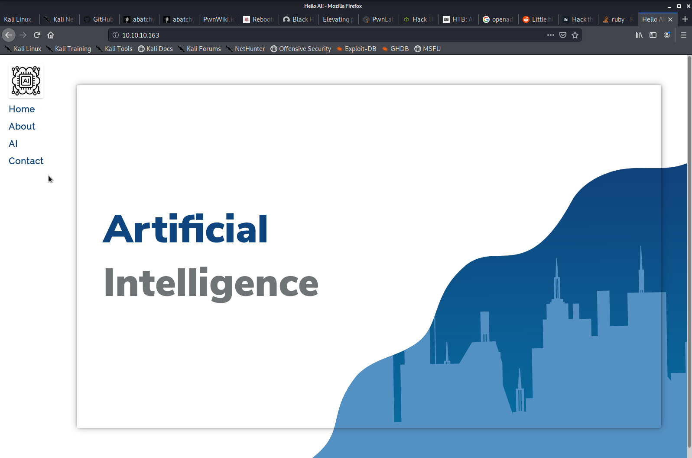

# HTB AI (10.10.10.163) MACHINE WRITE-UP

### TABLE OF CONTENTS

* [PART 1 : INITIAL RECON](#part-1--initial-recon)
* [PART 2 : PORT ENUMERATION](#part-2--port-enumeration)
  * [TCP PORT 80 (http)](#tcp-port-80-http)
* [PART 3 : EXPLOITATION](#part-3--exploitation)
* [PART 4 : GENERATE USER SHELL](#part-4--generate-user-shell)
* [PART 5 : LATERAL MOVEMENT (nobody -&gt; monitor)](#part-5--lateral-movement-nobody---monitor)
* [PART 6 : PRIVILEGE ESCALATION (monitor -&gt; root)](#part-6--privilege-escalation-monitor---root)
---

## PART 1 : INITIAL RECON

As usual, we begin with our nmap scan using defult scripts and enumerate versions.

```console
# nmap -sC -sV -oA nmap/ai 10.10.10.163
Starting Nmap 7.80 ( https://nmap.org ) at 2020-02-04 00:41 EST
Nmap scan report for 10.10.10.163
Host is up (0.18s latency).
Not shown: 998 closed ports
PORT   STATE SERVICE VERSION
22/tcp open  ssh     OpenSSH 7.6p1 Ubuntu 4ubuntu0.3 (Ubuntu Linux; protocol 2.0)
| ssh-hostkey: 
|   2048 6d:16:f4:32:eb:46:ca:37:04:d2:a5:aa:74:ed:ab:fc (RSA)
|   256 78:29:78:d9:f5:43:d1:cf:a0:03:55:b1:da:9e:51:b6 (ECDSA)
|_  256 85:2e:7d:66:30:a6:6e:30:04:82:c1:ae:ba:a4:99:bd (ED25519)
80/tcp open  http    Apache httpd 2.4.29 ((Ubuntu))
|_http-server-header: Apache/2.4.29 (Ubuntu)
|_http-title: Hello AI!
Service Info: OS: Linux; CPE: cpe:/o:linux:linux_kernel
```
We only have two ports open, SSH on Port 22 and its banner tells us its an Ubuntu server, we also have http on port 80 and its banner tells us its running __Apache httpd 2.4.29__.

---

## PART 2 : PORT ENUMERATION

### TCP PORT 80 (http)

- __`http://10.10.10.163`__:




