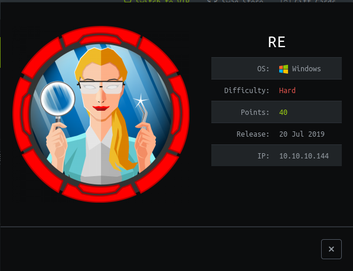

# HTB AI (10.10.10.144) MACHINE WRITE-UP

- This was a really fun box and my first attempt at reverse engineering. I did a lot of research and sleepless nights. Finally it paid off. Without further ado, lets jump in.


---

### TABLE OF CONTENTS
* [PART 1 : INITIAL RECON](#part-1--initial-recon)
* [PART 2 : PORT ENUMERATION](#part-2--port-enumeration)
  * [TCP PORT 80 (http)](#tcp-port-80-http)
* [PART 3 : EXPLOITATION](#part-3--exploitation)
* [PART 4 : GENERATE USER SHELL](#part-4--generate-user-shell)
* [PART 5 : LATERAL MOVEMENT (nobody -&gt; monitor)](#part-5--lateral-movement-nobody---monitor)
* [PART 6 : PRIVILEGE ESCALATION (monitor -&gt; root)](#part-6--privilege-escalation-monitor---root)

---

## PART 1 : INITIAL RECON

- As usually we'll begin with our nmap using defult scripts and enumerate versions.

```console
:~/CTF/HTB/boxes/RE# nmap -sC -sV -oA nmap/re 10.10.10.144
Starting Nmap 7.80 ( https://nmap.org ) at 2020-02-13 05:07 EST
Nmap scan report for 10.10.10.144
Host is up (0.18s latency).
Not shown: 998 filtered ports
PORT    STATE SERVICE       VERSION
80/tcp  open  http          Microsoft IIS httpd 10.0
|_http-server-header: Microsoft-IIS/10.0
|_http-title: Visit reblog.htb
445/tcp open  microsoft-ds?
Service Info: OS: Windows; CPE: cpe:/o:microsoft:windows

Host script results:
|_clock-skew: 1h06m32s
| smb2-security-mode:
|   2.02:
|_    Message signing enabled but not required
| smb2-time:
|   date: 2020-02-13T11:14:52
|_  start_date: N/A

Service detection performed. Please report any incorrect results at https://nmap.org/submit/ .
Nmap done: 1 IP address (1 host up) scanned in 78.62 seconds
```
- We have two ports open:

    * Port 80 : Http

        * It's banner tells us its Windows box running __IIS__ version __httpd 10.0__ which is most likely a [windows server 2016](https://port135.com/2015/07/24/a-summary-of-iis-versions/) box

        * It is also leaking a title __reblog.htb__ which could be a potential host name hence I will add that to the __/etc/hosts__

    * Port 445 : SMB

        * 
