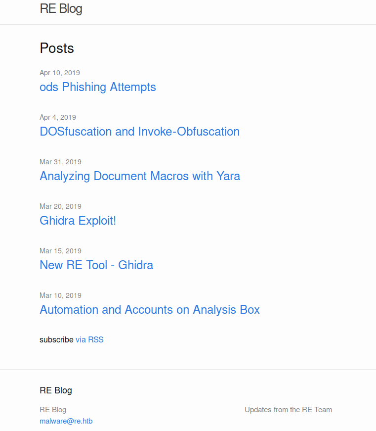

# HTB AI (10.10.10.144) MACHINE WRITE-UP

- This was a really fun box and my first attempt at reverse engineering. I did a lot of research and sleepless nights. Finally it paid off. Without further ado, lets jump in.


---

### TABLE OF CONTENTS
* [PART 1 : INITIAL RECON](#part-1--initial-recon)
* [PART 2 : PORT ENUMERATION](#part-2--port-enumeration)
  * [TCP PORT 80 (http)](#tcp-port-80-http)
  * [TCP PORT 445 (http)](#tcp-port-445-SMB)
* [PART 3 : EXPLOITATION](#part-3--exploitation)
* [PART 4 : GENERATE USER SHELL](#part-4--generate-user-shell)
* [PART 5 : LATERAL MOVEMENT (nobody -&gt; monitor)](#part-5--lateral-movement-nobody---monitor)
* [PART 6 : PRIVILEGE ESCALATION (monitor -&gt; root)](#part-6--privilege-escalation-monitor---root)

---

## PART 1 : INITIAL RECON

- As usually we'll begin with our nmap using defult scripts and enumerate versions.

```console
:~/CTF/HTB/boxes/RE# nmap -sC -sV -oA nmap/re 10.10.10.144
Starting Nmap 7.80 ( https://nmap.org ) at 2020-02-13 05:07 EST
Nmap scan report for 10.10.10.144
Host is up (0.18s latency).
Not shown: 998 filtered ports
PORT    STATE SERVICE       VERSION
80/tcp  open  http          Microsoft IIS httpd 10.0
|_http-server-header: Microsoft-IIS/10.0
|_http-title: Visit reblog.htb
445/tcp open  microsoft-ds?
Service Info: OS: Windows; CPE: cpe:/o:microsoft:windows

Host script results:
|_clock-skew: 1h06m32s
| smb2-security-mode:
|   2.02:
|_    Message signing enabled but not required
| smb2-time:
|   date: 2020-02-13T11:14:52
|_  start_date: N/A

Service detection performed. Please report any incorrect results at https://nmap.org/submit/ .
Nmap done: 1 IP address (1 host up) scanned in 78.62 seconds
```
- We have two ports open:

    * Port 80 : Http

        * It's banner tells us its Windows box running __IIS__ version __httpd 10.0__ which is most likely a [windows server 2016](https://port135.com/2015/07/24/a-summary-of-iis-versions/) box

        * It is also leaking a title __reblog.htb__ which could be a potential host name hence I will add that to the __/etc/hosts__

    * Port 445 : SMB

        *  We have a *clock-skew of 1h06m32s* so if we are to do any form of time sensitive attacks such as kerberos we will have to sync our times.

---

## PART 2 : PORT ENUMERATION

### TCP PORT 80 (http)

 - Lets head over to the website and check it out.

- Visiting [10.10.10.144](http://10.10.10.144) its a redirect to _reblog.htb_


- When you click on the redirect, our box doesn't know how to get there. So lets create the host entry for this box.

- Now we go back to firefox and reload page we get:



- Checking out the page source to see what this page is created in, whether joomla or wordpress.

- In the source, I see references to [Jekyll](https://jekyllrb.com/), which is a static site generator. That suggests it’s likely not exploitable.

    *fUN FACT: This page you are viewing is also created with jekyll*

- Checking out the pages one by one i come up with below key points:

1. on the *Automation and accounts on analysis box* page we see its telling us to always use low privileges accounts on your windows box so that the malware cannot access your machine. A potential username too *coby*

2. Next post talks about a tool called Ghidra released by the NSA for malware analysis and tells you where to download it and another potential username *Kenny*

3. Next post Ghidra exploit talks about opening a port, JDWPD. Nothing interesting here.

4. Next Analyzing document macros with Yara and its pointing to a blog post by the machine creators just talking about yara. Checking out the blog

    - I note below a yml extract

```console
rule metasploit
{
    strings:
        $getos = "select case getGUIType" nocase
        $getext = "select case GetOS" nocase
        $func1 = "Sub OnLoad" nocase
        $func2 = "Sub Exploit" nocase
        $func3 = "Function GetOS() as string" nocase
        $func4 = "Function GetExtName() as string" nocase

    condition:
        (all of ($get*) or 3 of ($func*))
}
```
5. On the DOSfuscation and Invoke-Obfuscation page we see two different tools to create obfuscation

6. And finally we have the ods Phishing Attempts. This was probably most interesting page. Below is an snippet

    *The SOC has been seeing lots of phishing attempts with ods attachements lately. It seems that we’ve got rules in place to detect any run of the mill stuff, including documents that are generated by Metasploit, documents with powershell or cmd invocations.*

    *If you see any interesting documents that might get past our yara rules, please drop them in the malware dropbox. I’ve got some automated processing that will see if our rules already identify it, and if not, run it to collect some log data and queue it for further analysis.*

- Now we have to go hunting for the malware dropbox.

- Checking out the SMB shares:


### TCP PORT 445(SMB)

- Using smbmap to list shared folders

```bash
:~/CTF/HTB/boxes/RE# smbmap -H 10.10.10.144 -u anonymous
[+] Finding open SMB ports....
[+] Guest SMB session established on 10.10.10.144...
[+] IP: 10.10.10.144:445        Name: reblog.htb                                        
        Disk                                                    Permissions     Comment
        ----                                                    -----------     -------
        .                                                  
        ...REDUCTED...
        IPC$                                                    READ ONLY       Remote IPC
        .                                                  
        dr--r--r--                0 Fri Feb 14 04:12:30 2020    .
        dr--r--r--                0 Fri Feb 14 04:12:30 2020    ..
        malware_dropbox                                         READ ONLY
```
- I don't know why my __smbmap__ is misbehaving even after updating to the current version. It says the malware_dropbox is read only and yet I can write files to it.

- That aside, lets have some fun with smbmap
