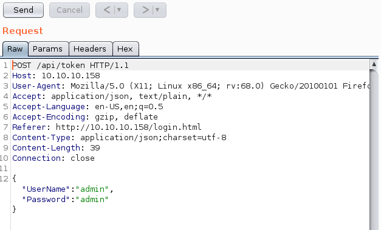
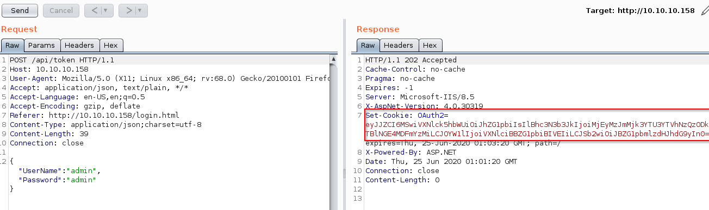

# HTB JSON (10.10.10.158) MACHINE WRITE-UP

-


---

### TABLE OF CONTENTS
* [PART 1 : INITIAL RECON](#part-1--initial-recon)
* [PART 2 : PORT ENUMERATION](#part-2--port-enumeration)
  * [TCP PORT 80 (http)](#tcp-port-80-http)
  * [TCP PORT 445 (http)](#tcp-port-445-SMB)
* [PART 3 : EXPLOITATION](#part-3--exploitation)
* [PART 4 : GENERATE USER SHELL](#part-4--generate-user-shell)
* [PART 5 : LATERAL MOVEMENT (nobody -&gt; monitor)](#part-5--lateral-movement-nobody---monitor)
* [PART 6 : PRIVILEGE ESCALATION (monitor -&gt; root)](#part-6--privilege-escalation-monitor---root)

---

## PART 1 : INITIAL RECON

- As usually we'll begin with our nmap using default scripts and enumerate versions. You can see more about that [here](https://explainshell.com/explain?cmd=nmap+-sS+-sV+-oA+nmap%2Fjson+10.10.10.158)

```console
root@kali:~/CTF/HTB/boxes/JSON# nmap -sC -sV -oA nmap/json 10.10.10.158
Starting Nmap 7.80 ( https://nmap.org ) at 2020-02-28 00:48 EST
Nmap scan report for 10.10.10.158
Host is up (0.39s latency).
Not shown: 988 closed ports
PORT      STATE SERVICE      VERSION
21/tcp    open  ftp          FileZilla ftpd
| ftp-syst:
|_  SYST: UNIX emulated by FileZilla
80/tcp    open  http         Microsoft HTTPAPI httpd 2.0 (SSDP/UPnP)
| http-methods:
|_  Potentially risky methods: TRACE
|_http-server-header: Microsoft-IIS/8.5
|_http-title: Json HTB
135/tcp   open  msrpc        Microsoft Windows RPC
139/tcp   open  netbios-ssn  Microsoft Windows netbios-ssn
445/tcp   open  microsoft-ds Microsoft Windows Server 2008 R2 - 2012 microsoft-ds
49152/tcp open  msrpc        Microsoft Windows RPC
49153/tcp open  msrpc        Microsoft Windows RPC
49154/tcp open  msrpc        Microsoft Windows RPC
49155/tcp open  msrpc        Microsoft Windows RPC
49156/tcp open  msrpc        Microsoft Windows RPC
49157/tcp open  msrpc        Microsoft Windows RPC
49158/tcp open  msrpc        Microsoft Windows RPC
Service Info: OSs: Windows, Windows Server 2008 R2 - 2012; CPE: cpe:/o:microsoft:windows

Host script results:
|_clock-skew: mean: 4h08m38s, deviation: 0s, median: 4h08m38s
|_nbstat: NetBIOS name: JSON, NetBIOS user: <unknown>, NetBIOS MAC: 00:50:56:b9:99:29 (VMware)
| smb-security-mode:
|   account_used: guest
|   authentication_level: user
|   challenge_response: supported
|_  message_signing: disabled (dangerous, but default)
| smb2-security-mode:
|   2.02:
|_    Message signing enabled but not required
| smb2-time:
|   date: 2020-02-28T09:58:40
|_  start_date: 2020-02-28T09:12:01

Service detection performed. Please report any incorrect results at https://nmap.org/submit/ .
Nmap done: 1 IP address (1 host up) scanned in 94.53 seconds
```

- We see we have a bunch of ports open.
- Lets check them out : We start with FTP using anonymous login.

```
root@kali:~/CTF/HTB/vpn# ftp 10.10.10.158
Connected to 10.10.10.158.
220-FileZilla Server 0.9.60 beta
220-written by Tim Kosse (tim.kosse@filezilla-project.org)
220 Please visit https://filezilla-project.org/
Name (10.10.10.158:root): anonymous
331 Password required for anonymous
Password:
530 Login or password incorrect!
Login failed.
Remote system type is UNIX.
ftp>
```
- Anonymous login was unsuccessful but we get the version number (220-FileZilla Server 0.9.60 beta)

- Next we have http on port 80 and it's running Microsoft II httpd 8.5 with a title *Json HTB*

- We also see a bunch of RPC ports open

- We have a clock-skew of 3h50m50s, if we do kerberos we will have to make sure we sync the time.

- Lets take a look at the web page.

## PART 2 : PORT ENUMERATION

### TCP PORT 80 (http)

- As soon as i get to the page it redirects me to http://10.10.10.158/login.html. Hmm first thought is to stop the redirect and examine the pages

- Nothing too interesting but a bunch of dead links everywhere.

- Lets try loggin in wwith admin admin and send it to burpsuite just to see how the request looks like.



- Its Json.

- Now lets see how the server responds.



- It responds with an Auth cookie. Lets see what this cookie is.
```console
/CTF/HTB/boxes/JSON# echo -n eyJJZCI6MSwiVXNlck5hbWUiOiJhZG1pbiIsIlBhc3N3b3JkIjoiMjEyMzJmMjk3YTU3YTVhNzQzODk0YTBlNGE4MDFmYzMiLCJOYW1lIjoiVXNlciBBZG1pbiBIVEIiLCJSb2wiOiJBZG1pbmlzdHJhdG9yIn0= | base64 -d
{"Id":1,"UserName":"admin","Password":"21232f297a57a5a743894a0e4a801fc3","Name":"User Admin HTB","Rol":"Administrator"}
```
- We get a cookies that has a bunch of Json
- So lets just forward this request and see what happens. And we get a successful login as admin but there is nothing much we can do.


oot@kali:~/CTF/HTB/boxes/JSON# echo -n 'checkoutmysite' | base64
Y2hlY2tvdXRteXNpdGU=
